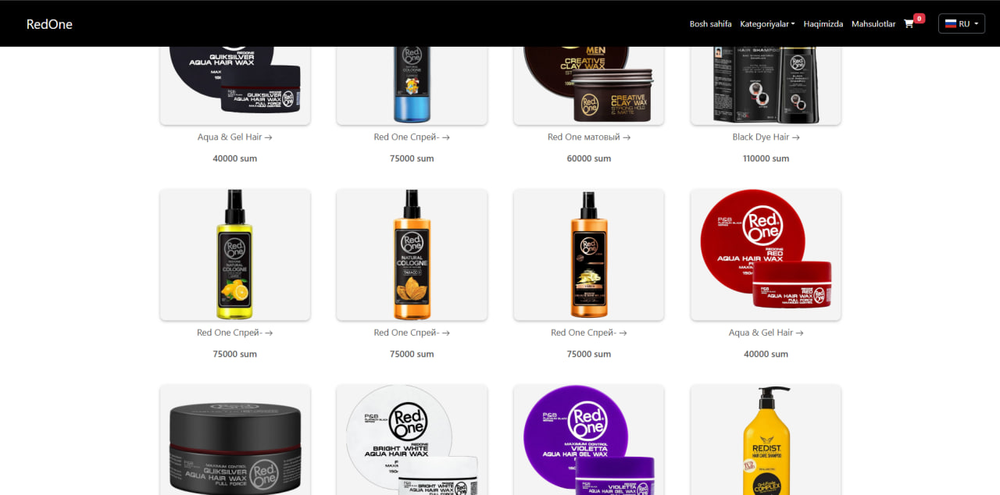

# 🛒 RedOne – Official Dealers Platform

**RedOne** is an online platform built for the official dealers of the Turkish brand **RedOne** in Uzbekistan.  
It allows customers to view all available products in one place, read descriptions, check images, and place orders quickly.  
The platform is integrated with a Telegram bot for easy order management.

---

## 🚀 Technologies
- **Backend:** Python 3.12, Django 5.0  
- **Bot:** Telebot  
- **Database:** SQLite3 (or PostgreSQL)  
- **Frontend:** Django Templates  

---

## ❗️ Features

- 📋 **Product List** – All products are displayed and sorted by categories  
- 🖼️ **Product Details** – Shows product description, price, size selection, and images  
- 🛒 **Shopping Cart** – Review or edit your order, enter contact information, and submit quickly  
- 📲 **Fast Checkout** – Simple, user-friendly process for customers  
- 🔑 **Admin Panel** – Add, edit, delete, or hide products (only accessible by admin)

---

## 🖼️ Screenshots

### 🗂️ Product List
  
Products are sorted by categories, making it easy for customers to find the desired item.

### 📄 Product Details
  
View detailed product information, choose size, and add it to the shopping cart.

### 🛒 Shopping Cart
  
Customers can review or edit their order, enter their phone number, and submit quickly.

### 🔧 Admin Panel
  
The admin panel allows adding, editing, deleting, and hiding products. Only authorized users can access it.

---

## ⚙️ Installation & Setup

Clone the repository and install dependencies:

```bash
git clone https://github.com/your-username/redone.git
cd redone
pip install -r requirements.txt
python manage.py migrate
python manage.py runserver
